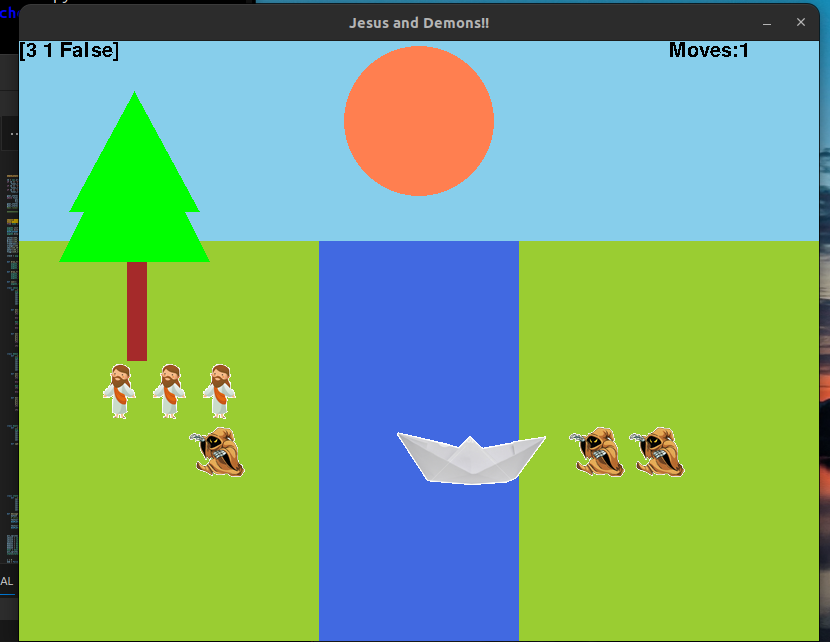

### What ? 
Implemented and analyzed efficacy of Classical AI search algorithms (A*, dfs and bfs) to solve missonary and cannibal problem.


### Dependencies required:
- pygame

### Executing the program :
python missandcann2.py ast


### SAMPLE OUTPUT ###
```python
** Running A* ***
path_to_goal:  [(3, 1, False), (3, 2, True), (3, 0, False), (3, 1, True), (1, 1, False), (2, 2, True), (0, 2, False), (0, 3, True), (0, 1, False), (1, 1, True), (0, 0, False)]
cost_of_path:  11
nodes_expanded:  13
search_depth:  11
max_search_depth:  11
running_time:  0.0004398822784423828
```


